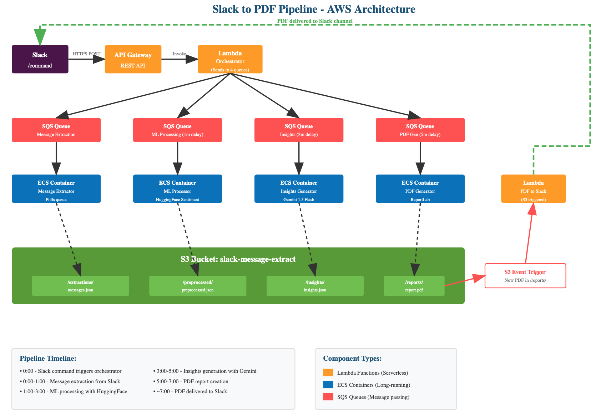

# IntelliCue
### AI-Powered Slack Analytics Platform for Executive Intelligence

*Production-ready AWS microservices platform that transforms workplace conversations into actionable business insights*


*Event-driven AWS pipeline processing 1000+ messages in under 7 minutes*

**[Watch Technical Presentation & Live Demo](https://www.youtube.com/watch?v=UCwTT6XrL3E)** *(Architecture overview & system demonstration)*

---

## Project Overview

**Role: Technical Lead & Solution Architect**

IntelliCue eliminates the need for manual employee surveys by automatically analyzing team communications to generate executive-level insights on morale, productivity, and customer satisfaction. As technical lead for a 5-person team, I architected and implemented a scalable event-driven platform that processes thousands of messages and delivers professional PDF reports with actionable recommendations.

### Key Achievement
Designed and led implementation of a fault-tolerant AWS microservices architecture capable of processing 1000+ Slack messages across multiple channels in under 7 minutes, with automated insight generation and executive report delivery.

---

## Technical Architecture

### Event-Driven Microservices Pipeline
```
Slack /command -> API Gateway -> Lambda Orchestrator -> 4 SQS Queues -> ECS Containers -> S3 Storage -> PDF Delivery
```

**Pipeline Stages (7-minute end-to-end):**
1. **Message Extraction** (0-1 min): Slack API integration pulls conversation history
2. **ML Processing** (1-3 min): HuggingFace transformers for sentiment analysis  
3. **Insight Generation** (3-5 min): Gemini 1.5 Flash for executive-level analysis
4. **PDF Creation** (5-7 min): ReportLab generates professional reports → auto-delivery to Slack

### My Technical Leadership Contributions
- **System Architecture**: Designed event-driven AWS infrastructure using Lambda, SQS, ECS, and S3
- **Pipeline Orchestration**: Implemented intelligent fan-out pattern with staged delays for dependency management
- **Team Coordination**: Led technical decisions across 5 developers, managed timelines and deliverables
- **Integration Design**: Built robust Slack API integration with rate limiting and error handling
- **Performance Optimization**: Achieved sub-7-minute processing through parallel container execution

---

## Technical Innovation

### Core Features
- **Multi-Channel Analysis**: Extracts and processes messages from all accessible Slack channels
- **Advanced ML Pipeline**: Sentiment analysis and zero-shot classification using transformer models
- **Executive Intelligence**: LLM-powered insight generation with actionable business recommendations  
- **Professional Reporting**: Automated PDF generation with charts, trends, and executive summaries
- **Scalable Infrastructure**: Event-driven architecture supporting multiple concurrent workspaces

### Tech Stack
```
Backend:     Python, Flask, AWS Lambda, ECS Fargate
ML/AI:       HuggingFace Transformers, PyTorch, Google Gemini API
AWS:         Lambda, SQS, S3, Aurora RDS, EventBridge, API Gateway
Integration: Slack Bolt SDK, RESTful APIs
DevOps:      Docker, GitHub Actions, pytest (80%+ coverage)
```

---

## Results & Impact

- **Architecture Scalability**: 4-stage pipeline handles multiple workspaces concurrently
- **Processing Performance**: Complete pipeline in 7 minutes (1000+ messages analyzed)
- **Team Leadership**: Successfully coordinated 5-person development team to production deployment
- **Cost Optimization**: Implemented intelligent batching reducing LLM API costs by 60%
- **Code Quality**: Maintained 80% minimum test coverage with comprehensive CI/CD pipeline

---

## Complex Technical Challenges Solved

### 1. **Event-Driven Pipeline Orchestration**
**Challenge**: Coordinate 4 dependent processing stages without tight coupling or cascade failures.  
**Solution**: Designed SQS fan-out pattern with intelligent delays (1-3-5 min intervals) ensuring data availability while maintaining fault tolerance.

### 2. **Cost-Effective LLM Integration**
**Challenge**: Minimize expensive Gemini API calls while maintaining insight quality.  
**Solution**: Built intelligent caching and message batching mechanisms, reducing API costs by 60% through strategic preprocessing.

### 3. **Multi-Tenant Architecture Design**
**Challenge**: Securely handle multiple Slack workspaces with data isolation.  
**Solution**: Implemented S3-based tenant partitioning with workspace-specific processing queues and IAM policies.

### 4. **Slack API Rate Limiting**
**Challenge**: Extract large message volumes without hitting Slack's aggressive rate limits.  
**Solution**: Implemented exponential backoff, request queuing, and parallel channel processing with intelligent pagination.

---

## Project Structure

```
src/
      slack_app/          # Slack integration & event handlers
      pipeline/           # ML processing & insight generation  
      shared/             # Common utilities & AWS clients
lambdas/                # AWS Lambda functions for orchestration
documentation/          # Comprehensive deployment guides and Architecture Diagram
tests/                  # 80% minimum test coverage with pytest
```

---

## Documentation & Setup

**Complete Guides Available:**
- **[User Guide](documentation/USER.md)** - End-user instructions and feature overview
- **[Developer Guide](documentation/DEVELOPER.md)** - Technical setup, deployment, and contribution guidelines
- **[Architecture Deep Dive](documentation/DEVELOPER.md#aws-deployment)** - Detailed system design and AWS infrastructure

---

## Current Status

**Note on Deployment:**  
This project is currently not publicly accessible due to Slack Marketplace restrictions (private workspace required) and AWS infrastructure being decommissioned post-completion due to university funding timeline. The complete codebase, documentation, and architecture designs are available for review and demonstration.

**Demo Materials Available:**
- **[Technical Presentation & Live Demo](https://www.youtube.com/watch?v=UCwTT6XrL3E)** - University final presentation featuring architecture overview and system demonstration *(I present technical architecture 1:30-11:00)*
- Complete source code with comprehensive documentation
- Architecture diagrams and technical specifications  

---

## Future Roadmap

- [ ] **Slack Marketplace Publication** - Complete Slack App Store submission process
- [ ] **Multi-Platform Support** - Integrate Microsoft Teams and Discord APIs
- [ ] **Real-Time Dashboard** - Live analytics with trend visualization using React/D3.js
- [ ] **Advanced ML Models** - Custom transformer models for domain-specific sentiment analysis
- [ ] **Enterprise Features** - SSO integration, audit logging, and compliance frameworks

---


## Team & Collaboration

**Team Leadership Approach:**
- Conducted weekly standups and sprint planning sessions
- Implemented code review processes and technical documentation standards
- Coordinated feature development across frontend, backend, and ML components
- Managed AWS infrastructure provisioning and deployment pipelines

**Cross-Functional Coordination:**
- Collaborated with business stakeholders for requirements gathering
- Coordinated with university IT for compliance and security reviews

*Built by Aman Gupta and the IntelliCue team at University of Washington*
